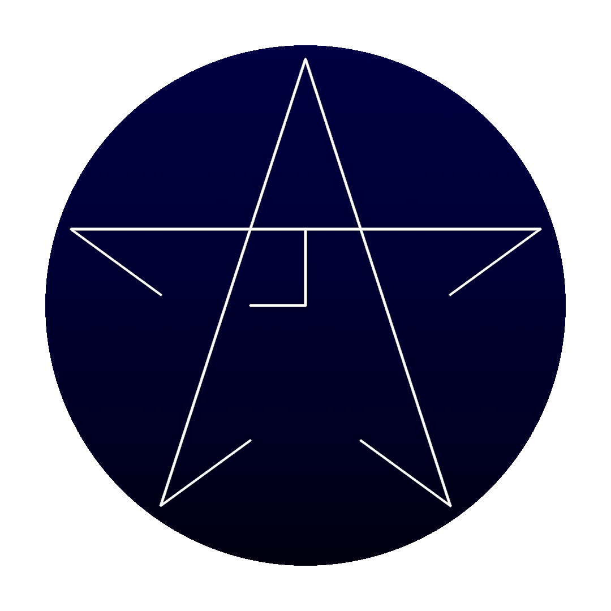

<h3 align="center">✨Jackestar✨</h3>

<b>Web Developer, Graphic Designer, Electronic Engineering Student, Linux lover</b>

 

<h3 align="center">Who am i :grey_question: </h3>

Hey 👋, I'm Jackestar, I'm passionate about electronics and computer science. I always try to find the most optimal solution to a problem and I love to exploit the potential of low-end hardware, meticulous in details and versatile in the face of any challenge.

<h3 align="center">What i'm doing :grey_question: </h3>

I am developing various personal projects and studying electronics, control theory, computer science and artificial intelligence. I am developing a series of tools through a web interface for calculations in the area of ​​electronics, as well as tools to optimize the workflow in ArchLinux

<h3 align="center">Softskills :fire: </h3>

Among my skills are the management of the Microsoft Office suite, Google Workspaces, management of various CAD and CAE tools, design programs, management of Linux and Windows operating systems, practical skills in the repair and maintenance of computer equipment and electronics, the management of Spanish and English languages

<h3 align="center">About my projects :star2: </h3>

All my projects are hosted on my website

Visit my <a href="https://jackestar.netlify.app/">Website</a> 
